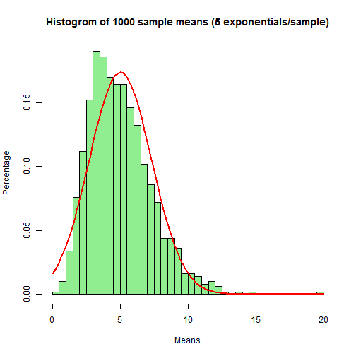
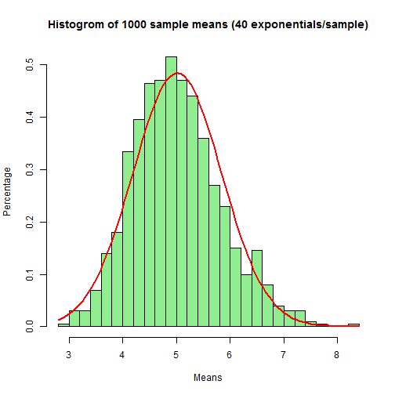
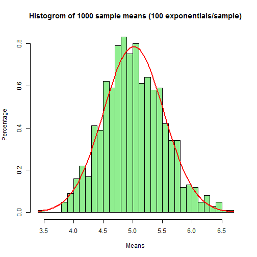
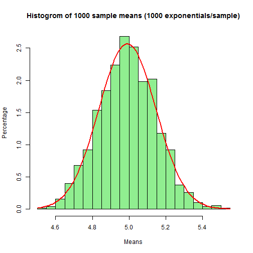

  
 <br><br> 
  
   
##Objective

 This assignment makes use of data from a personal activity monitoring device. This device collects data at 5 minute intervals through out the day. The data consists of two months of data from an anonymous individual collected during the months of October and November, 2012 and include the number of steps taken in 5 minute intervals each day.


##Tasks

- Loading and preprocessing the data
- Calculate mean (total number of steps taken per day)
- Explore the average daily activity pattern
- Imputing missing values
- Explore the differences in activity patterns between weekdays and weekends


##Data
* The data for this assignment was downloaded from the [course web site](https://d396qusza40orc.cloudfront.net/repdata%2Fdata%2Factivity.zip)

* loading data


```r
## create data folder if not exist
if(!file.exists("./data")){
    dir.create("data")
}

##download file and unzip if the file not exist
filename = "./data/activity.csv"
if (!file.exists(filename)) {
    ## download url and destination file
    file.url <- 'https://d396qusza40orc.cloudfront.net/repdata%2Fdata%2Factivity.zip'
    file.dest <- './data/Activity_monitoring_data.zip'
    ## download from the URL
    download.file(file.url, file.dest)
    unlink(file.url)
    unzip('./data/Activity_monitoring_data.zip', files = "activity.csv", exdir = "./data")

}
##read file
activity <-  read.csv(filename, header=T,
                      sep=",", stringsAsFactors=F, na.strings="NA",
                      colClasses=c("numeric", "character", "numeric")
                        )

activity$date <- as.Date(activity$date, "%Y-%m-%d")
```

## Calculate the mean (total number of steps taken per day)
  * Make a histogram of the total number of steps taken each day
  * Calculate and report the mean and median total number of steps taken per day
  

```r
##calculate the total steps taken each day
steps_by_day <- aggregate(steps ~ date, activity, sum, na.rm=TRUE)
##make histogram
hist(steps_by_day$steps, main = paste("Total Steps Each Day"), col="red", xlab="Number of Steps")
```

 

```r
## mean steps
mymean <- mean(steps_by_day$steps)
## median steps
mymedian <- median(steps_by_day$steps)
print(paste("mean=", format(mymean,digits = 8), "    ",  "median=", format(mymedian,digits = 8)))
```

```
## [1] "mean= 10766.189      median= 10765"
```

## Explore the average daily activity pattern
* Make a time series plot (i.e. type = "l") of the 5-minute interval (x-axis) and the average number of steps taken, averaged across all days (y-axis)

* Which 5-minute interval, on average across all the days in the dataset, contains the maximum number of steps

```r
##calculate the mean steps for each interval
steps_by_interval <- aggregate(steps ~ interval, activity, mean)
##make scatter plot
plot(steps_by_interval$interval,steps_by_interval$steps, type="l", xlab="Interval", ylab="Number of Steps",main="Average Number of Steps per Day by Interval")
```

 

```r
max_interval <- steps_by_interval[which.max(steps_by_interval$steps),1]
print(paste("maximum number of steps=", max_interval))
```

```
## [1] "maximum number of steps= 835"
```

##Imputing missing values


* Calculate and report the total number of missing values in the dataset (i.e. the total number of rows with NAs)

* Use the mean to fill in impute the missing data.

* Create a new dataset that is equal to the original dataset but with the missing data filled in.

* Make a histogram of the total number of steps taken each day and Calculate and report the mean and median total number of steps taken per day. Do these values differ from the estimates from the first part of the assignment? What is the impact of imputing missing data on the estimates of the total daily number of steps?


```r
##Total number of lines with NA
sum(!complete.cases(activity))
```

```
## [1] 2304
```

```r
require(Hmisc)
activityImputed <- activity
activityImputed$steps <- impute(activity$steps, fun=mean)
activityImputed$interval <- impute(activity$interval, fun=mean)
##check the number of lines with NA
sum(!complete.cases(activityImputed))
```

```
## [1] 0
```

```r
Imputedsteps_by_day <- aggregate(steps ~ date, activityImputed, sum, na.rm=TRUE)
##make histogram
hist(Imputedsteps_by_day$steps, main = paste("Total Steps Each Day"), col="red", xlab="Number of Steps")
```

 

```r
##Calculate mean and median with imputed data
myinputedmean <- mean(Imputedsteps_by_day$steps)
myinputedmedian <- median(Imputedsteps_by_day$steps)

## difference between imputed and no-imputed data
diffmean <- myinputedmean-mymean
diffmymedian <- myinputedmedian-mymedian
print(paste("Diff in mean=", format(diffmean,digits = 8), "    ",  "Diff in median=", format(diffmymedian,digits = 8)))
```

```
## [1] "Diff in mean= 0      Diff in median= 1.1886792"
```

##Differences in activity patterns between weekdays and weekends
* Create a new factor variable in the dataset with two levels -- "weekday" and "weekend" indicating whether a given date is a weekday or weekend day.

* Make a panel plot containing a time series plot (i.e. type = "l") of the 5-minute interval (x-axis) and the average number of steps taken, averaged across all weekday days or weekend days (y-axis).


```r
## add weekday or weekend
activityImputed$wday <- weekdays(activityImputed$date)
myweekend <- c("Saturday", "Sunday")
activityImputed$dateType <-  ifelse(activityImputed$wday %in% myweekend, 'weekend', 'weekday')
##calculate means of steps on each interval and datetype
Averagedstep_by_interva <- aggregate(steps ~ interval + dateType, data=activityImputed, mean)
## make graph
require(lattice)
xyplot(Averagedstep_by_interva$steps ~ Averagedstep_by_interva$interval|Averagedstep_by_interva$dateType, main="Average Steps per Day by Interval (weekday, weekend)",xlab="Interval", ylab="Steps",layout=c(1,2), type="l")
```

 


